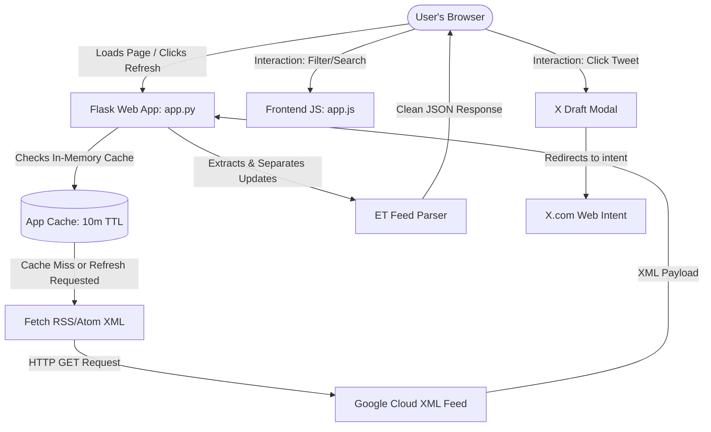

# BigQuery Release Notes Explorer: Implementation & Architecture Plan

This document details the architecture, design choices, data flow, and file mapping implemented for the BigQuery Release Notes Explorer.

## 1. System Overview & Architecture

The application is built using a lightweight **Python Flask backend** and a modern **Vanilla HTML/CSS/JavaScript frontend**. It fetches and parses the official BigQuery RSS/Atom release notes feed, caches the content, and displays it in a responsive interface with rich styling and sharing capabilities.



---

## 2. Key Architecture Decisions

### 2.1 Backend Data Processing & Caching
* **Built-in XML Parsing:** Uses Python's standard `xml.etree.ElementTree` and `urllib.request` instead of external libraries like `feedparser` or `BeautifulSoup`. This keeps dependencies low, avoids setup bugs, and ensures fast execution.
* **Granular Announcement Splitting:** Google's feed combines multiple updates into a single daily entry (e.g. Feature, Announcement, and Deprecation elements are grouped inside one `<entry>`). The parser uses regular expression boundaries (`<h3>`) to split these into distinct entries. This allows users to filter, search, and Tweet specific updates rather than the whole day's log.
* **10-minute Server-Side Cache:** To avoid redundant round-trips to the Google Cloud server, feed contents are cached in-memory with a 10-minute Time-To-Live (TTL). A query parameter `refresh=true` allows bypassing the cache to load fresh logs.

### 2.2 Modern Frontend Design System
* **CSS Custom Properties (Themes):** Implemented variables for background, text, border, inputs, and category color codes supporting light and dark themes. 
* **Top-Layer Animating (`@starting-style`):** Dialog boxes utilize native CSS starting styles and transitions (`overlay`, `allow-discrete`) to perform animations as elements enter and leave the browser top-layer.
* **Responsive Dashboard Stats:** Summarizes update metrics. Clicking on individual stats cards acts as an interactive filter trigger.
* **Skeleton Loaders:** A flashing visual skeleton mimics the document layout when fetching or refreshing, ensuring a smooth visual flow.

### 2.3 Intelligent Tweet Share Integration
* **Twitter Character Safety:** Character counts are computed dynamically. The algorithm searches for URLs within the text and counts them as 23 characters (simulating Twitter's actual behavior). 
* **Automated Content Truncation:** To prevent exceeding the 280-character limit, text excerpts are automatically truncated to fit the URL, prefix title, and hashtags safely.

---

## 3. Project File Mapping

The application codebase is organized as follows:

| File path | Description | Core Responsibilities |
| :--- | :--- | :--- |
| **[app.py](../app.py)** | Flask Backend Router | XML fetching, JSON formatting, sanitizing tags, routing. |
| **[templates/index.html](../templates/index.html)** | Page Structure Template | Skeletons, filters panel, details modal dialog, tweet modal dialog. |
| **[static/css/style.css](../static/css/style.css)** | App Styling & Layout | Theme properties, glassmorphism, starting styles, skeleton pulses, layout grids. |
| **[static/js/app.js](../static/js/app.js)** | UI Logic Controller | API calls, dashboard stats updates, event listeners, character limits, tweet composer. |

---

## 4. Run & Development Guide

To start or maintain the application:

```bash
# 1. Navigate to the project directory
cd bq-releases-notes

# 2. Activate python virtual environment
source venv/bin/activate

# 3. Run Flask on custom port 5001 (Port 5000 is often taken by macOS system settings)
PORT=5001 python app.py
```

Open your browser to [http://localhost:5001](http://localhost:5001) to interact with the application.
